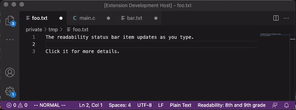

# readability

VSCode extension for evaluating english readability of plain text documents.
The extension adds a status bar item with the overall readability score.

Clicking the status bar item provides a more details analysis report.

Note that the score is only showing for plain text documents.

